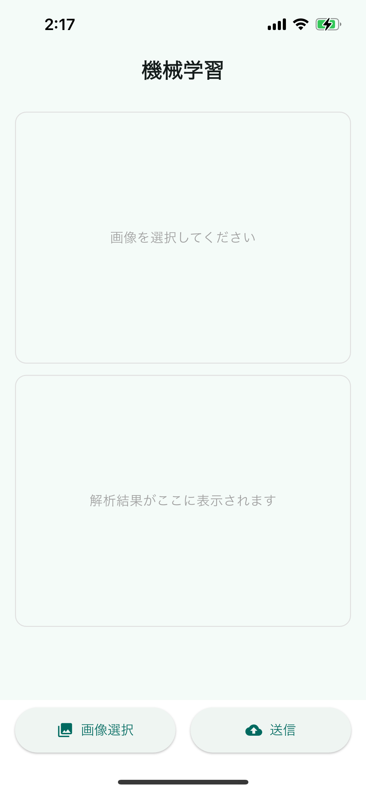
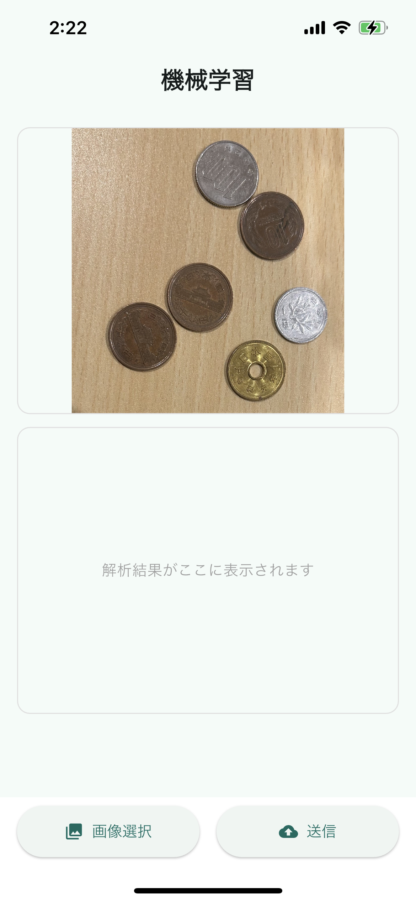

# Detect Coins Frontend

コイン画像を選択・送信し、検出結果（合計金額・検出後画像）を表示する Flutter アプリです。  
バックエンド（Flask + Detectron2）と連携して動作します。

## 使い方

1. アプリを起動します。
2. 「画像選択」ボタンをタップし、ギャラリーからコイン画像を選択します。
3. 「送信」ボタンをタップすると、検出結果が表示されます。

- 合計金額ラベルが画面中央に表示されます。
- 検出後画像をタップするとズーム表示できます。

## 画面イメージ

| ホーム画面             | 画像選択後                     | 検出結果表示               | ズーム時               |
| ---------------------- | ------------------------------ | -------------------------- | ---------------------- |
|  |  |  |  |

### 開発用の起動

ローカルのバックエンドサーバー（例: Flask）に接続する前提です。

```bash
make run
```

※ `lib/config/dev.json` にバックエンド URL などを記載してください。

## セットアップ

1. 必要なパッケージを取得します。
    ```bash
    flutter pub get
    ```
2. アプリアイコンを生成する場合
    ```bash
    make icon
    ```

## 環境ファイル例

`lib/config/dev.json` の例:

```json
{
  "baseUrl": "http://<あなたのバックエンドサーバのURL>:5000"
}
```

## 注意事項

- このアプリはバックエンドが稼働していることが前提です。
- 送信先のURLやAPI仕様が異なる場合は `lib/config/dev.json` を適宜調整してください。